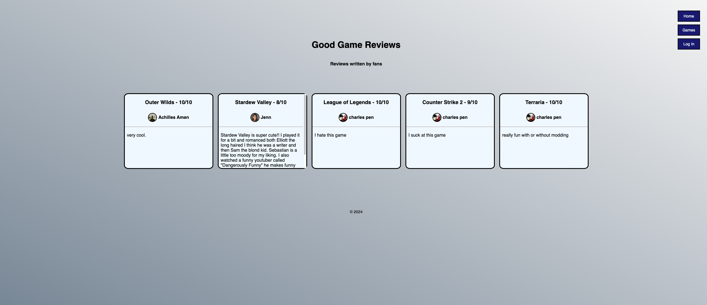
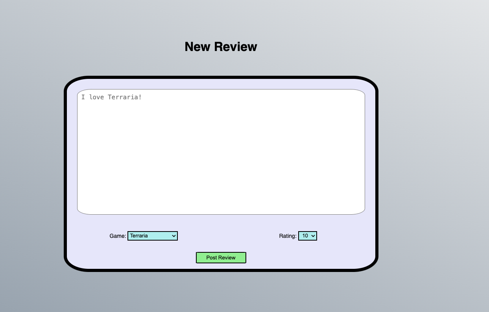
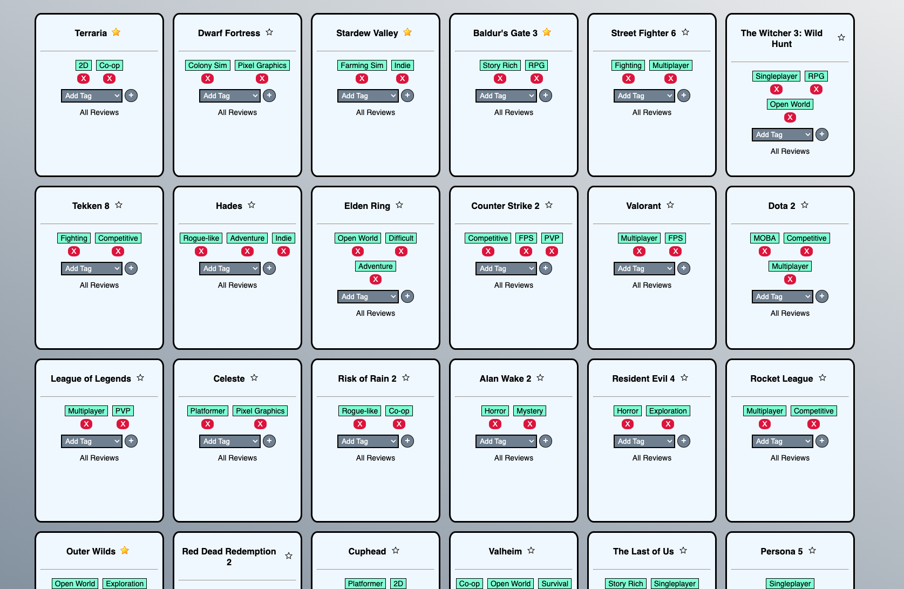
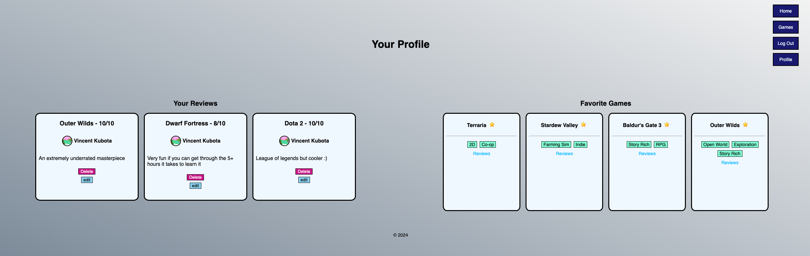

# Good Game Reviews
Have you every wanted to tell people about your opinion on a game, but only want to share it with a very very small audience _(because we have 10 users)_? Good Game Reviews is the perfect site to share them on!

Good Game Reviews, as the title mentions, is a site where you can post and view reviews on popular games.

## Photos

Trello Planning: [Trello link](https://trello.com/b/bgOTgdGp/project-2)

#### Landing page

#### Create a post

#### Game list

#### Profile page

## Technologies Used

## Getting Started

Deployed site: [Website link](https://good-game-reviews-096487dcaa4f.herokuapp.com/)

#### Making a post

1. Log in using the nav bar at the top right of the page
2. Once you log in you will be at your profile, so navigate to the home page
3. Click the "Make a Review" button
4. Type whatever you'd like, then select a game and a rating.
5. Submit the post

#### Favoriting a game

1. Click games in the navigation bar
2. Click the star on a game to add it to your favorites
3. Navigate to your profile by using the "Profile" button in the navigation bar
4. Your favorited game will be in the "Favorite Games" section

## Next Steps

- **Navigating to other user profiles:** Since users can click on "Profle" in the nav bar to see their own profile, the user should be able to click on the usernernames in other posts to see their reviews and favorite games.

- **Sorting games:** On the games page the user should be able to sort the available games by their tags and favorites.

- **Commenting on Posts:** On user reviews, users should be able to comment on posts made to agree or offer counter points to their opinion.

- **Sort reviews by date:** After an extended period of the website being up, the user should be able to sort reviews by their post date. The User schema already has timestamps, so this could be a quick addition.